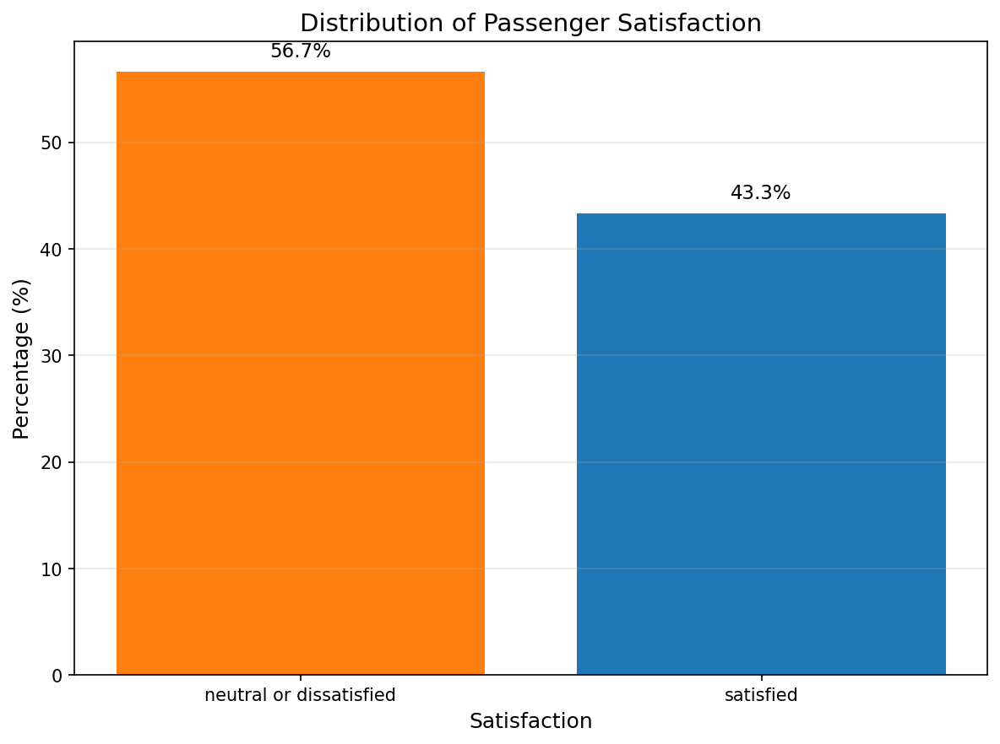
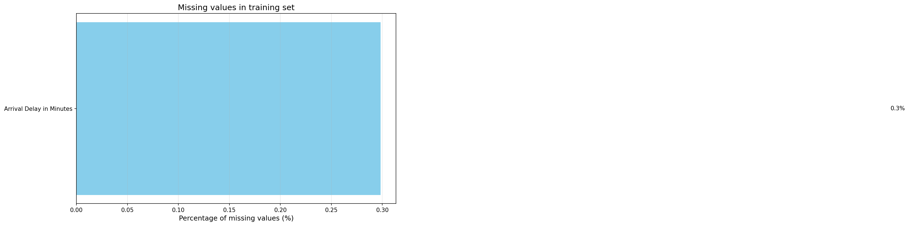
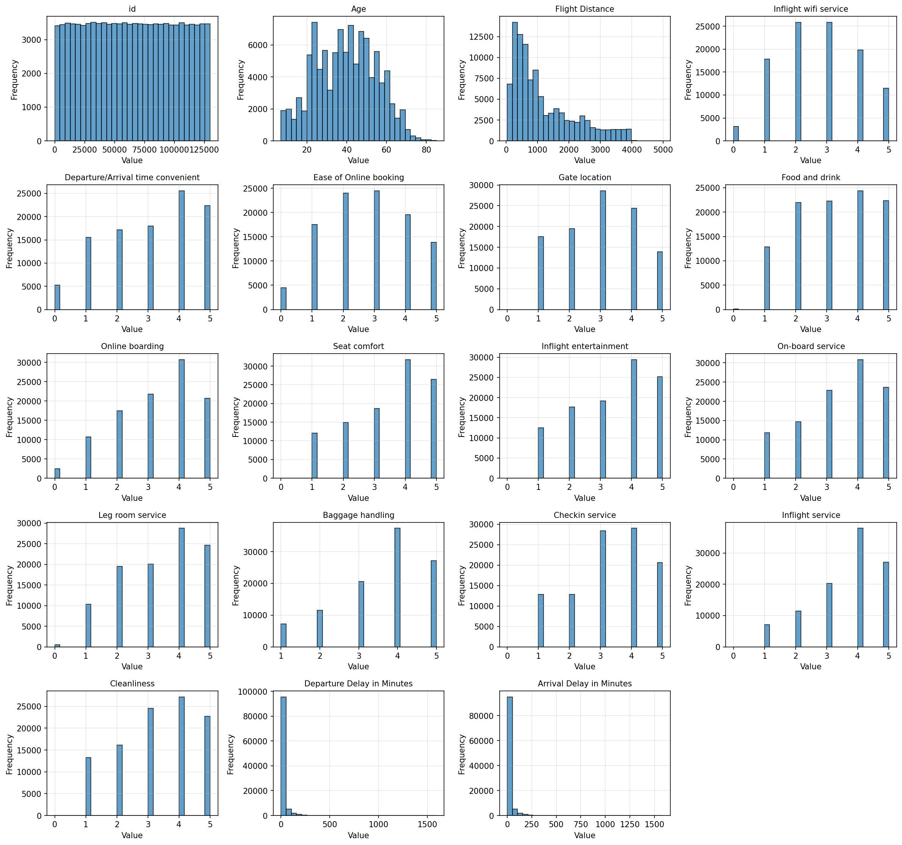
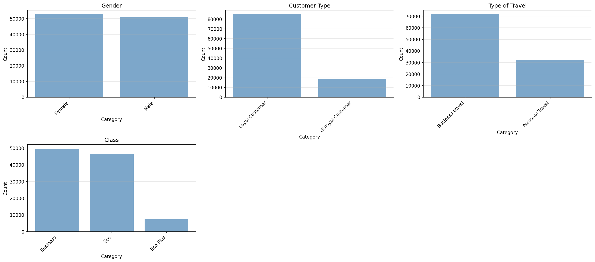
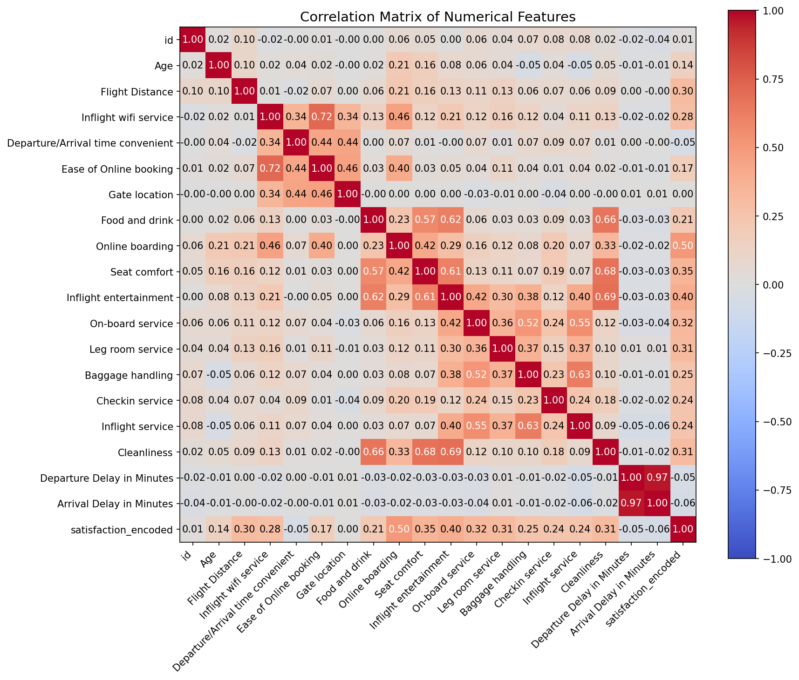

# Eksploracyjna analiza danych (EDA) - Airline Passenger Satisfaction

## 1. Przegląd zbioru danych
Zbiór danych Airline Passenger Satisfaction zawiera informacje o 129,880 pasażerach linii lotniczych, którzy wypełnili ankiety satysfakcji po podróży.

**Podstawowe informacje:**
- Łączna liczba pasażerów: 129,880
- Zbiór treningowy: 103,904 pasażerów
- Zbiór testowy: 25,976 pasażerów
- Liczba cech: 24 (w tym zmienna celu)
- Liczba pasażerów zadowolonych: 45,025 (34.7%)
- Liczba pasażerów neutralnych/niezadowolonych: 84,855 (65.3%)

**Struktura danych:**
```
id                            - identyfikator pasażera
Gender                        - płeć (Male, Female)
Customer Type                 - typ klienta (Loyal Customer, disloyal Customer)
Age                           - wiek (lata)
Type of Travel                - typ podróży (Business travel, Personal Travel)
Class                         - klasa (Business, Eco, Eco Plus)
Flight Distance               - odległość lotu (mile)
Inflight wifi service         - ocena wifi pokładowego (0-5)
Departure/Arrival time convenient - ocena dogodności godzin (0-5)
Ease of Online booking        - ocena łatwości rezerwacji online (0-5)
Gate location                 - ocena lokalizacji bramki (0-5)
Food and drink                - ocena jedzenia i napojów (0-5)
Online boarding               - ocena odprawy online (0-5)
Seat comfort                  - ocena komfortu siedzenia (0-5)
Inflight entertainment        - ocena rozrywki pokładowej (0-5)
On-board service              - ocena obsługi pokładowej (0-5)
Leg room service              - ocena miejsca na nogi (0-5)
Baggage handling              - ocena obsługi bagażu (0-5)
Checkin service               - ocena odprawy (0-5)
Inflight service              - ocena usług pokładowych (0-5)
Cleanliness                   - ocena czystości (0-5)
Departure Delay in Minutes    - opóźnienie odlotu (minuty)
Arrival Delay in Minutes      - opóźnienie przylotu (minuty)
satisfaction                  - satysfakcja (satisfied, neutral or dissatisfied)
```

## 2. Analiza brakujących wartości
Brakujące wartości stanowią niewielkie wyzwanie w tym zbiorze danych:

| Kolumna | Brakujące wartości (trening) | Procent (trening) | Brakujące wartości (test) | Procent (test) |
|---------|-----------------------------|-------------------|--------------------------|----------------|
| Arrival Delay in Minutes | 310 | 0.30% | 83 | 0.32% |

**Wnioski:**
- Tylko jedna kolumna zawiera brakujące wartości
- Procent brakujących wartości jest minimalny (<0.5%)
- Można zastosować prostą imputację (mediana lub średnia)

## 3. Statystyki opisowe zmiennych numerycznych

### Wiek (Age)
```
count    103904.000000
mean         39.379706
std          15.114964
min           7.000000
25%          27.000000
50%          40.000000
75%          51.000000
max          85.000000
skewness     -0.004516
kurtosis     -0.719568
```

**Obserwacje:**
- Średni wiek: 39.4 lata
- Mediana: 40 lat (rozkład prawie symetryczny)
- Najmłodszy pasażer: 7 lat
- Najstarszy pasażer: 85 lat
- Rozkład zbliżony do normalnego (skewness ≈ 0)

### Odległość lotu (Flight Distance)
```
count    103904.000000
mean       1189.448375
std         997.147281
min          31.000000
25%         414.000000
50%         843.000000
75%        1743.000000
max        4983.000000
skewness      1.109466
kurtosis      0.268535
```

**Obserwacje:**
- Średnia odległość: 1,189 mil
- Mediana: 843 mile (rozkład prawostronnie skośny)
- Minimalna odległość: 31 mil (krótkie loty)
- Maksymalna odległość: 4,983 mil (długie loty międzykontynentalne)

### Opóźnienie odlotu (Departure Delay in Minutes)
```
count    103904.000000
mean         14.815618
std          38.230901
min           0.000000
25%           0.000000
50%           0.000000
75%          12.000000
max        1592.000000
skewness      6.733980
kurtosis    100.267006
```

**Obserwacje:**
- Średnie opóźnienie: 14.8 minut
- Mediana: 0 minut (większość lotów bez opóźnień)
- Rozkład silnie prawostronnie skośny
- Maksymalne opóźnienie: 1592 minut (~26.5 godzin)

### Opóźnienie przylotu (Arrival Delay in Minutes)
```
count    103594.000000
mean         15.178678
std          38.698682
min           0.000000
25%           0.000000
50%           0.000000
75%          13.000000
max        1584.000000
skewness      6.596637
kurtosis     94.537006
```

**Obserwacje:**
- Średnie opóźnienie: 15.2 minut
- Podobny rozkład do opóźnienia odlotu
- Nieco wyższe wartości średnie

### Oceny usług (0-5)
Wszystkie oceny usług mają podobny rozkład:
- Średnie oceny: 2.7-3.6
- Odchylenie standardowe: 1.2-1.4
- Rozkłady lekko lewostronnie skośne (więcej wysokich ocen)
- Najwyższe średnie oceny: Baggage handling (3.63), Inflight service (3.64)
- Najniższe średnie oceny: Inflight wifi service (2.73), Ease of Online booking (2.76)

## 4. Analiza zmiennych kategorycznych

### Płeć (Gender)
| Wartość | Liczba | Procent |
|---------|--------|---------|
| Female | 52,727 | 50.75% |
| Male | 51,177 | 49.25% |

**Obserwacje:** Prawie równy rozkład płci.

### Typ klienta (Customer Type)
| Wartość | Liczba | Procent |
|---------|--------|---------|
| Loyal Customer | 84,923 | 81.73% |
| disloyal Customer | 18,981 | 18.27% |

**Obserwacje:** Dominują lojalni klienci.

### Typ podróży (Type of Travel)
| Wartość | Liczba | Procent |
|---------|--------|---------|
| Business travel | 71,655 | 68.96% |
| Personal Travel | 32,249 | 31.04% |

**Obserwacje:** Większość podróży w celach biznesowych.

### Klasa (Class)
| Wartość | Liczba | Procent |
|---------|--------|---------|
| Business | 49,665 | 47.80% |
| Eco | 46,745 | 44.99% |
| Eco Plus | 7,494 | 7.21% |

**Obserwacje:** Prawie równy rozkład między Business a Eco, niewiele miejsc Eco Plus.

## 5. Wizualizacje

### Rozkład zmiennej celu


*Rysunek 1: Rozkład satysfakcji pasażerów - 56.7% neutralnych/niezadowolonych, 43.3% zadowolonych*

### Brakujące wartości


*Rysunek 2: Rozkład brakujących wartości - tylko kolumna Arrival Delay in Minutes*

### Rozkłady cech numerycznych


*Rysunek 3: Histogramy cech numerycznych - wiek, odległość lotu, opóźnienia, oceny usług*

### Rozkłady cech kategorycznych


*Rysunek 4: Rozkłady cech kategorycznych - płeć, typ klienta, typ podróży, klasa*

## 6. Analiza korelacji i zależności

### Macierz korelacji


*Rysunek 5: Macierz korelacji cech numerycznych - silne korelacje między ocenami usług*

### Top 10 najsilniejszych korelacji:
1. Departure Delay in Minutes - Arrival Delay in Minutes: 0.965
2. Inflight wifi service - Ease of Online booking: 0.716
3. Cleanliness - Inflight entertainment: 0.692
4. Seat comfort - Cleanliness: 0.679
5. Food and drink - Cleanliness: 0.658
6. Online boarding - Seat comfort: 0.655
7. On-board service - Seat comfort: 0.654
8. Leg room service - Seat comfort: 0.653
9. Inflight service - Baggage handling: 0.645
10. Cleanliness - On-board service: 0.644

**Wnioski:**
- Opóźnienia odlotu i przylotu są silnie skorelowane (oczywiste)
- Oceny różnych usług są ze sobą skorelowane (pasażerowie konsekwentnie oceniają)
- Najsilniejsze korelacje między usługami pokładowymi

## 7. Analiza wartości odstających

Wykryto wartości odstające (Z-score > 3):

| Cecha | Liczba wartości odstających | Procent | Średnia | Odchylenie |
|-------|----------------------------|---------|---------|------------|
| Age | 17 | 0.016% | 39.38 | 15.11 |
| Flight Distance | 58 | 0.056% | 1189.45 | 997.15 |
| Inflight service | 3 | 0.003% | 3.64 | 1.18 |
| Departure Delay in Minutes | 2,222 | 2.139% | 14.82 | 38.23 |
| Arrival Delay in Minutes | 2,225 | 2.141% | 15.18 | 38.70 |

**Wnioski:**
- Opóźnienia mają znaczną liczbę wartości odstających (ponad 2%)
- Wiek i odległość lotu mają niewielką liczbę wartości odstających
- Wartości odstające w opóźnieniach mogą wymagać przycięcia (winsoryzacji)

## 8. Wnioski i rekomendacje dla przetwarzania danych

**Kluczowe wnioski z EDA:**
1. **Brakujące wartości:** Nieliczne, prosta imputacja medianą wystarczy.
2. **Wartości odstające:** Opóźnienia mają wiele wartości odstających - rozważ winsoryzację.
3. **Korelacje:** Silne korelacje między ocenami usług - możliwość redukcji wymiarowości (PCA).
4. **Rozkłady:** Oceny usług lekko lewostronnie skośne, opóźnienia silnie prawostronnie skośne.
5. **Zmienne kategoryczne:** Wymagają kodowania (label encoding lub one-hot encoding).

**Rekomendacje dla przetwarzania:**
1. **Imputacja:** Uzupełnij brakujące wartości w 'Arrival Delay in Minutes' medianą.
2. **Przycięcie wartości odstających:** Zastosuj winsoryzację dla opóźnień (cap przy 99 percentylu).
3. **Kodowanie kategoryczne:** Użyj label encoding dla zmiennych kategorycznych.
4. **Skalowanie:** Zastosuj StandardScaler dla cech numerycznych.
5. **Inżynieria cech:** Utwórz nowe cechy: grupy wiekowe, kategorie odległości, flagi opóźnień.
6. **Redukcja wymiarowości:** Rozważ PCA dla ocen usług ze względu na wysokie korelacje.

**Zalecenia dla modelowania:**
1. Użyj stratified sampling ze względu na niezbalansowane klasy.
2. Rozważ oversampling/undersampling lub ważenie klas.
3. Przetestuj różne modele, zwłaszcza ensemble methods (Random Forest, Gradient Boosting).
4. Oceń modele za pomocą ROC-AUC, a nie tylko accuracy.

## 9. Podsumowanie EDA

Eksploracyjna analiza danych ujawniła kluczowe wzorce w danych satysfakcji pasażerów linii lotniczych:
- Dane są względnie czyste z nielicznymi brakującymi wartościami
- Opóźnienia mają skrajne wartości wymagające przetworzenia
- Oceny usług są silnie skorelowane, co sugeruje możliwość redukcji cech
- Rozkład klas jest niezbalansowany (57% vs 43%)
- Cechy demograficzne i podróżnicze wykazują zróżnicowane rozkłady

Te obserwacje stanowią solidną podstawę dla dalszego przetwarzania danych i budowy modeli predykcyjnych.