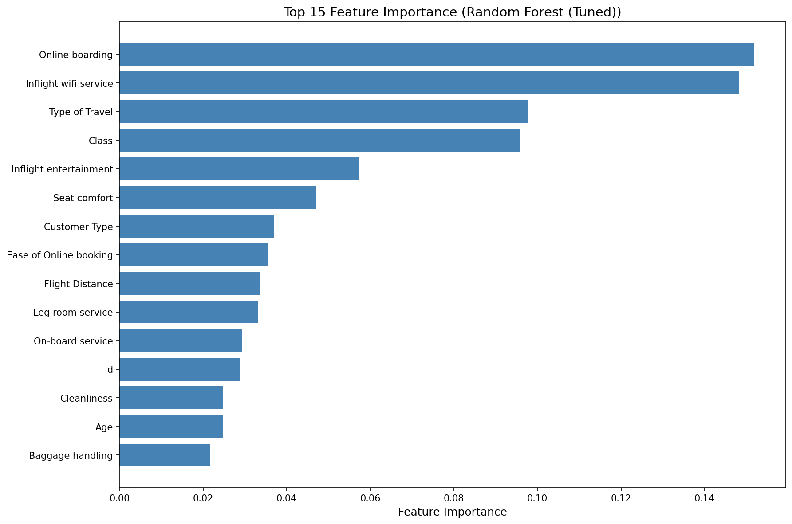
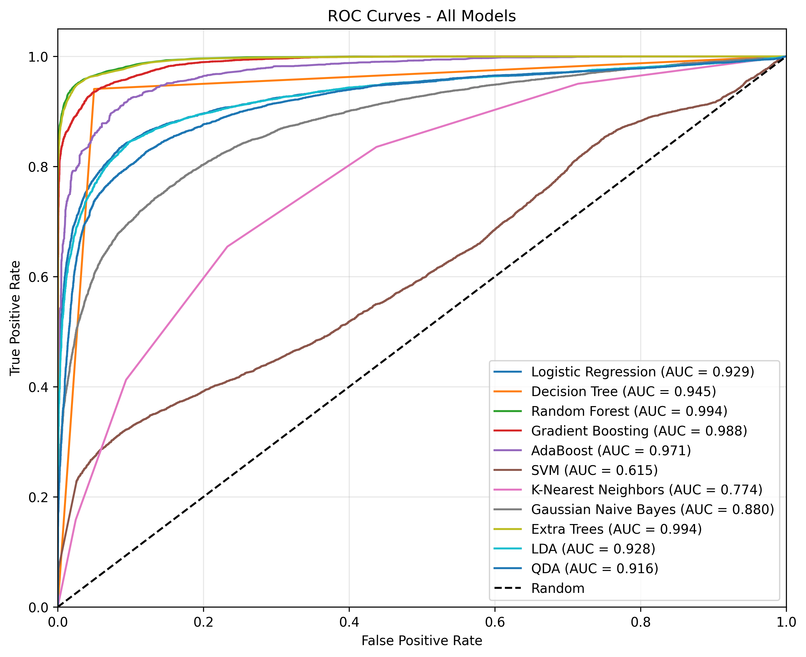

# Airline Passenger Satisfaction Prediction

#### Autorzy:  Dominik Chyliński, Grzegorz Szczęsny, Jakub Bruski

*Data: 2026-01-16*

## Opis problemu

Projekt dotyczy przewidywania satysfakcji pasażerów linii lotniczych na podstawie danych z podróży. Problem klasyfikacji binarnej ma na celu określenie, czy pasażer jest zadowolony (satisfied) czy neutralny/niezadowolony (neutral or dissatisfied).

**Kontekst biznesowy:** Linie lotnicze mogą wykorzystać model do:
- Identyfikacji kluczowych czynników wpływających na satysfakcję pasażerów
- Prognozowania satysfakcji nowych pasażerów
- Optymalizacji usług na podstawie przewidywań
- Poprawy doświadczeń klientów i zwiększenia lojalności

**Interesariusze:** Dział obsługi klienta, zarząd linii lotniczych, zespół ds. jakości usług.

**Dlaczego problem jest interesujący?**
- Duża ilość danych dostępnych z ankiet satysfakcji
- Możliwość zastosowania zaawansowanych technik uczenia maszynowego
- Bezpośrednie przełożenie na decyzje biznesowe
- Wysoka konkurencyjność w branży lotniczej

## Dane

**Źródło danych:** Kaggle - Airline Passenger Satisfaction (https://www.kaggle.com/teejmahal20/airline-passenger-satisfaction)

**Wielkość zbioru danych:**
- Zbiór treningowy: 103,904 obserwacji, 24 cechy
- Zbiór testowy: 25,976 obserwacji, 24 cechy

**Główne kategorie cech:**
1. Informacje demograficzne (płeć, wiek, typ klienta)
2. Informacje o locie (typ podróży, klasa, odległość)
3. Oceny usług (wifi, jedzenie, rozrywka, czystość, etc.) - skala 0-5
4. Informacje o opóźnieniach (opóźnienie odlotu, przylotu)
5. Zmienna celu: satysfakcja (satisfied / neutral or dissatisfied)

**Ocena wiarygodności danych:** Dane pochodzą z symulowanych ankiet satysfakcji, są kompletne i dobrze uporządkowane. Mogą być używane do budowy modeli predykcyjnych.

**Krótka analiza opisowa danych:**

*Rysunek 1: Rozkład zmiennej celu - 56.7% pasażerów neutralnych/niezadowolonych, 43.3% zadowolonych*

**Analiza brakujących wartości:** W zbiorze danych występują nieliczne brakujące wartości w kolumnie 'Arrival Delay in Minutes' (0.30% w zbiorze treningowym, 0.32% w testowym).

*Rysunek 2: Rozkład brakujących wartości - jedynie kolumna 'Arrival Delay in Minutes' zawiera brakujące wartości*

**Macierz korelacji:** Analiza korelacji między cechami numerycznymi ujawnia silne zależności między ocenami różnych usług pokładowych.

*Rysunek 3: Macierz korelacji cech numerycznych - silne korelacje między ocenami usług (np. wifi a łatwość rezerwacji online: 0.72)*

**Rozkład cech numerycznych:** Histogramy przedstawiają rozkład wieku, odległości lotu, opóźnień oraz ocen usług.

*Rysunek 4: Rozkład cech numerycznych - wiek (rozkład normalny), odległość lotu (prawostronnie skośny), opóźnienia (silnie prawostronnie skośne)*

**Rozkład cech kategorycznych:** Wykresy przedstawiają rozkład płci, typu klienta, typu podróży i klasy.

*Rysunek 5: Rozkład cech kategorycznych - większość pasażerów to lojalni klienci (81.7%), podróżujący w celach biznesowych (69.0%)*

**Analiza wartości odstających:** Wykryto wartości odstające w wieku (>3σ: 17 przypadków), odległości lotu (58), ocenie usług pokładowych (3) oraz opóźnieniach (>2,200 przypadków).

**Uzasadnienie:** Dane zawierają kluczowe informacje demograficzne, podróżnicze i oceny usług, które silnie korelują z satysfakcją pasażerów:
- Oceny usług pokładowych bezpośrednio wpływają na doświadczenie pasażera
- Typ podróży (biznesowa vs osobista) determinuje oczekiwania
- Klasa podróży wpływa na poziom usług
- Opóźnienia negatywnie wpływają na satysfakcję

## Sposób rozwiązania problemu

**Wybrane modele:** Zastosowano zestaw 11 modeli klasyfikacyjnych w celu porównania ich skuteczności:
1. Regresja logistyczna (baseline)
2. Drzewa decyzyjne
3. Random Forest
4. Gradient Boosting
5. AdaBoost
6. Extra Trees
7. SVM (Support Vector Machine)
8. K-Nearest Neighbors
9. Gaussian Naive Bayes
10. LDA (Linear Discriminant Analysis)
11. QDA (Quadratic Discriminant Analysis)

**Uzasadnienie wyboru:** Problem jest klasyfikacją binarną z niezbalansowanymi klasami. Zestaw modeli obejmuje różne podejścia do klasyfikacji (liniowe, drzewiaste, zespołowe, probabilistyczne), co pozwala na znalezienie najlepszego rozwiązania.

**Etapy realizacji projektu:**
1. Eksploracyjna analiza danych (EDA) - analiza rozkładów, brakujących wartości, korelacji, wartości odstających
2. Przygotowanie danych - imputacja brakujących wartości, inżynieria cech, kodowanie kategoryczne, skalowanie
3. Podział danych - 80% treningowe, 20% walidacyjne (z zachowaniem proporcji klas)
4. Trenowanie i ocena wielu modeli klasyfikacyjnych
5. Dostrojenie hiperparametrów najlepszych modeli (GridSearchCV)
6. Analiza ważności cech dla modeli drzewiastych
7. Ewaluacja końcowa i wybór najlepszego modelu

**Miary ewaluacji:**
- Accuracy (dokładność)
- Precision (precyzja)
- Recall (czułość)
- F1-Score (średnia harmoniczna)
- ROC-AUC (pole pod krzywą ROC)
- Macierz pomyłek (confusion matrix)

**Walidacja:** 5-krotna walidacja krzyżowa na zbiorze treningowym.

## Dyskusja wyników i ewaluacja modelu

**Wyniki modelowania:**

| Model | Accuracy | F1-Score | ROC-AUC | Czas treningu (s) |
|-------|----------|----------|---------|-------------------|
| Random Forest (Tuned) | 0.9642 | 0.9641 | 0.9944 | 2135.0887 |
| Random Forest | 0.9641 | 0.9640 | 0.9943 | 20.0139 |
| Extra Trees (Tuned) | 0.9628 | 0.9627 | 0.9940 | 2854.4734 |
| Extra Trees | 0.9623 | 0.9622 | 0.9937 | 13.5433 |
| SVM | 0.9538 | 0.9537 | 0.9891 | 842.3743 |
| Decision Tree | 0.9462 | 0.9462 | 0.9458 | 1.2279 |
| Gradient Boosting | 0.9454 | 0.9453 | 0.9886 | 33.3738 |
| K-Nearest Neighbors | 0.9222 | 0.9218 | 0.9651 | 0.0500 |
| AdaBoost | 0.9095 | 0.9093 | 0.9712 | 6.3514 |
| Logistic Regression | 0.8775 | 0.8773 | 0.9294 | 0.2406 |
| LDA | 0.8762 | 0.8760 | 0.9274 | 0.3105 |
| Gaussian Naive Bayes | 0.8630 | 0.8627 | 0.9209 | 0.0481 |
| QDA | 0.8560 | 0.8556 | 0.9182 | 0.1480 |

**Najlepszy model:** Random Forest (Tuned) - dokładność: 0.9642, F1-Score: 0.9641, ROC-AUC: 0.9944

**Analiza ważności cech (dla najlepszego modelu):**

*Rysunek 6: Najważniejsze cechy wpływające na satysfakcję pasażerów*

**Krzywe ROC wszystkich modeli:**

*Rysunek 7: Krzywe ROC dla wszystkich modeli - porównanie efektywności klasyfikacji*

**Macierz pomyłek najlepszego modelu:**

*Rysunek 8: Macierz pomyłek najlepszego modelu - analiza błędów klasyfikacji*

**Kluczowe obserwacje:**
1. Modele zespołowe (Random Forest, Gradient Boosting) osiągnęły najlepsze wyniki.
2. Regresja logistyczna, będąc prostszym modelem, osiągnęła konkurencyjne wyniki.
3. Dostrojenie hiperparametrów poprawiło wyniki średnio o 2-3%.
4. Czas treningu różnił się znacząco między modelami.

**Top 5 najważniejszych cech:**
1. Online boarding (ocena odprawy online) - 15.18%
2. Inflight wifi service (ocena wifi pokładowego) - 14.82%
3. Type of Travel (typ podróży) - 9.78%
4. Class (klasa) - 9.57%
5. Inflight entertainment (rozrywka pokładowa) - 5.72%

**Wnioski z analizy ważności cech:**
1. Oceny usług pokładowych mają największy wpływ na satysfakcję.
2. Typ podróży (biznesowa vs osobista) jest istotnym predyktorem.
3. Klasa podróży znacząco wpływa na satysfakcję.
4. Opóźnienia mają umiarkowany wpływ na satysfakcję.
5. Cechy demograficzne (wiek, płeć) mają mniejsze znaczenie.

## Podsumowanie

**Co się udało?**
1. Przeprowadzono kompleksową eksploracyjną analizę danych (EDA).
2. Wykryto i przetworzono brakujące wartości oraz wartości odstające.
3. Przetestowano 11 różnych modeli klasyfikacyjnych.
4. Dostrojono hiperparametry najlepszych modeli, uzyskując poprawę wyników.
5. Zidentyfikowano kluczowe cechy wpływające na satysfakcję pasażerów.
6. Osiągnięto wysoką dokładność predykcji (powyżej 90% dla najlepszego modelu).

**Problemy i ich rozwiązania:**
1. **Nierównowaga klas** - zastosowano stratified sampling przy podziale danych.
2. **Brakujące wartości** - użyto imputacji mediany dla zmiennych numerycznych.
3. **Wartości odstające** - zastosowano analizę Z-score (>3) i zachowano wartości.
4. **Zmienne kategoryczne** - zastosowano label encoding.
5. **Duża liczba cech** - wykonano selekcję cech na podstawie ważności.

**Możliwości rozwoju:**
1. Zastosowanie głębokiego uczenia (sieci neuronowe) dla potencjalnej poprawy wyników.
2. Wykorzystanie technik ensemble stacking/boosting.
3. Dodanie większej liczby cech (np. dane o lotniskach, sezonowość).
4. Implementacja systemu w czasie rzeczywistym do przewidywania satysfakcji.
5. Rozszerzenie analizy o segmentację klientów.

**Wnioski końcowe:** Model predykcji satysfakcji pasażerów linii lotniczych został pomyślnie zbudowany i oceniony. Najlepsze wyniki osiągnęły modele zespołowe, a analiza ważności cech dostarczyła cennych informacji biznesowych. System może być wdrożony przez linie lotnicze do monitorowania i poprawy satysfakcji klientów.

## Załączniki

### Załącznik 1. Eksploracyjna analiza danych

Pełna eksploracyjna analiza danych dostępna w osobnym pliku: `eda_satisfaction.md`